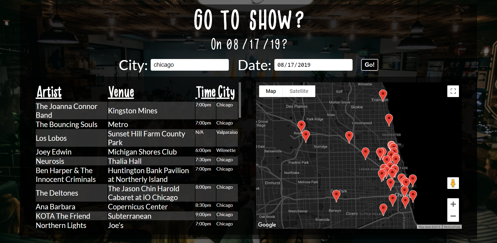
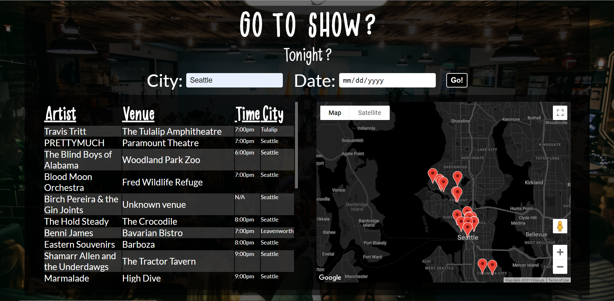
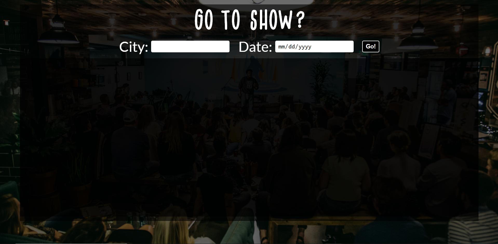

Go To Show

Go To Show is a concert & event search app. 

https://anthonygelder.github.io/go-to-show/

Enter the city you want to search for. The date is optional. If you leave it blank, it will default to today. The results of your search will be a table that has the artist, which links to a Songkick page with the summary of the event. You will see the venue, which you can click on it to go to the google maps page of the venue. The start time will be displayed. The city will only be displayed on a screen larger than a phone screen. You will also see an embedded Google map, with the venues plotted on the map. Click on the markers to see the information.

HTML/CSS/JavaScript/jQuery